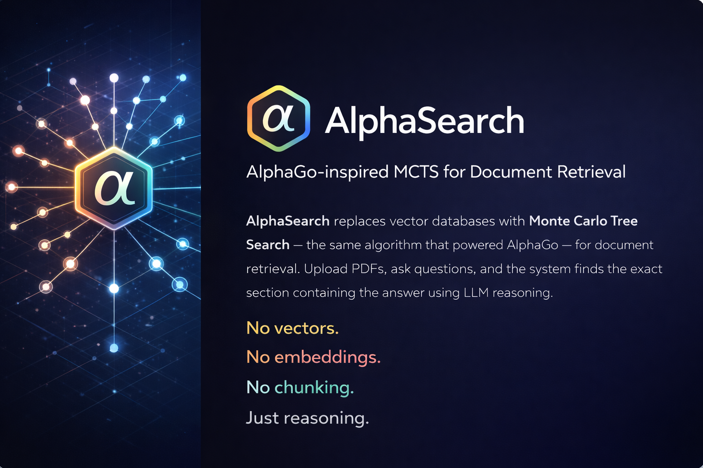

<div align="center">

# AlphaSearch

### AlphaGo-inspired MCTS for Document Retrieval

<br>



<br>
<br>

AlphaSearch replaces vector databases with **Monte Carlo Tree Search** — the same algorithm that powered AlphaGo — for document retrieval. Upload PDFs, ask questions, and the system finds the exact section containing the answer using LLM reasoning.

**No vectors. No embeddings. No chunking. Just reasoning.**

</div>

---

## Two Modes

### 📄 Single PDF Mode
Upload one document, ask questions instantly. No folders, no setup.

**Pipeline:** Upload → Index → Phase 2 (MCTS section search) → Deep Read → Answer

### 📁 Folder Mode
Organize documents into folders. The system auto-routes queries to the right folder, picks the right document, finds the right section.

**Pipeline:** Phase 0 (auto-route) → Phase 1 (doc selection) → Phase 2 (section search) → Deep Read → Answer

---

## Quick Start

```bash
git clone https://github.com/CyberGhost007/alphasearch.git
cd alphasearch
pip install -r requirements.txt

cp .env.example .env
# Edit .env → OPENAI_API_KEY=sk-...

python server.py
```

Open **http://localhost:8000** → pick Single PDF or Folders.

### Single PDF Mode (`/single`)
1. Click **Manage** → upload a PDF
2. Wait for indexing
3. Ask your question → get answer with citations

### Folder Mode (`/folders`)
1. Click **Manage** → **New Folder** → name it
2. Expand folder → **Upload PDFs**
3. Close sidebar → ask anything across all your documents

---

## How It Works

```
User: "What was the total project cost?"

Single Mode:                           Folder Mode:
─────────────                          ─────────────
                                       Phase 0 — Router Agent
                                       Scores folder summaries
                                       → picks "Project Zenith" (94%)
                                            │
                                       Phase 1 — Doc Selection
                                       MCTS on meta-tree
                                       → budget.pdf, proposal.pdf
                                            │
Phase 2 — Section Search              Phase 2 — Section Search (parallel)
MCTS on document tree                 MCTS on each selected doc
→ "Cost Summary" (pp.5-8)             → "Cost Summary" (pp.5-8)
     │                                      │
Deep Read — GPT-4o Vision             Deep Read — GPT-4o Vision
Reads actual page images              Reads actual page images
→ extracts $812,000                    → extracts $812,000
     │                                      │
Answer with citations                 Answer with cross-doc citations
```

The key insight: MCTS uses summaries for **navigation** (cheap, GPT-4o-mini) but reads the **original PDF pages** for answers (accurate, GPT-4o vision). Summaries are signposts, not the source.

---

## Features

### MCTS-Powered Search
- **UCB1 formula** balances exploitation (high-scoring sections) and exploration (unvisited sections)
- **Backpropagation** — if a subsection scores high, its siblings become more likely to be explored
- **Early stopping** — converges when confident, saving LLM calls
- **Parallel Phase 2** — searches multiple documents simultaneously via ThreadPoolExecutor

### Document Management
- **Single mode:** Upload one PDF, ask questions, swap documents anytime
- **Folder mode:** Create folders, upload multiple PDFs, auto-routing across all docs
- **Per-document caching** — MD5 hash comparison, unchanged files skip re-indexing
- **Health check & repair** — detects missing PDFs, stale indices, orphaned files

### Production-Ready
- 13 custom exceptions covering every failure mode
- PDF validation (magic bytes, corrupt, empty, too large, wrong extension)
- Atomic file writes to prevent corruption on crash
- Thread-safe folder operations with per-folder locks
- Batch upload with partial failure handling

### Chat Interface
- Landing page to pick mode (Single PDF / Folders)
- Mode-appropriate sidebar (upload dropzone vs folder CRUD)
- Folder badge with confidence score on each response
- Source cards with document, section, pages, and relevance score
- Chat history context for follow-up questions

---

## CLI Usage

```bash
# Start web server
python server.py

# Unified chat (auto-routes across folders)
python main.py chat

# Folder management
python main.py folder create "My Project"
python main.py folder add "My Project" report.pdf analysis.pdf
python main.py folder list
python main.py folder info "My Project"
python main.py folder health "My Project"
python main.py folder repair "My Project"

# Search
python main.py search "My Project" "What were the key findings?"
python main.py search-doc "My Project" report.pdf "What was Q3 revenue?"

# Interactive mode
python main.py interactive "My Project"

# Standalone single PDF
python main.py query report.pdf "Summarize this document"

# Inspect a tree index
python main.py inspect .treerag_data/folders/project/indices/doc_tree.json
```

---

## Python API

```python
from treerag.config import TreeRAGConfig
from treerag.pipeline import TreeRAGPipeline

config = TreeRAGConfig.from_env()
pipeline = TreeRAGPipeline(config)

# --- Single document ---
doc_index = pipeline.index("report.pdf")
result = pipeline.query_document("What was Q3 revenue?", doc_index)
print(result.answer)

# --- Folder mode ---
pipeline.folder.create_folder("project")
pipeline.folder.add_document("project", "report.pdf")
pipeline.folder.add_document("project", "appendix.pdf")

# Auto-route chat
result = pipeline.chat("What was the total budget?")
print(result.content)
print(result.folder_name)

# Direct folder search
result = pipeline.query_folder("Phase 2 costs?", "project")
```

---

## REST API

### Landing & UI
| Endpoint | Method | Description |
|----------|--------|-------------|
| `/` | GET | Landing page (pick mode) |
| `/single` | GET | Single PDF chat UI |
| `/folders` | GET | Folder mode chat UI |

### Single Mode
| Endpoint | Method | Description |
|----------|--------|-------------|
| `/api/single/upload` | POST | Upload + index a PDF |
| `/api/single/chat` | POST | Query the uploaded document |
| `/api/single/status` | GET | Check if a document is loaded |
| `/api/single/reset` | POST | Clear document + chat history |

### Folder Mode
| Endpoint | Method | Description |
|----------|--------|-------------|
| `/api/folders` | GET | List all folders |
| `/api/folders` | POST | Create folder |
| `/api/folders/{name}` | DELETE | Delete folder |
| `/api/folders/{name}/documents` | POST | Upload + index PDF into folder |
| `/api/folders/{name}/documents/{file}` | DELETE | Remove document |
| `/api/folders/chat` | POST | Chat with auto-routing |
| `/api/folders/chat/reset` | POST | Clear chat history |

### System
| Endpoint | Method | Description |
|----------|--------|-------------|
| `/api/health` | GET | Health check (folders, single status, usage) |

---

## Configuration

Only `OPENAI_API_KEY` is required.

```bash
OPENAI_API_KEY=sk-...          # Required

INDEXING_MODEL=gpt-4o          # Vision model for reading PDF pages
SEARCH_MODEL=gpt-4o-mini      # Cheap model for MCTS simulations
ANSWER_MODEL=gpt-4o           # Heavy model for final answers

MCTS_ITERATIONS=25            # Phase 2 iterations per document
MCTS_META_ITERATIONS=15       # Phase 1 iterations (folder mode)
TOP_K_DOCUMENTS=3             # Max docs selected in Phase 1
PARALLEL_PHASE2=true          # Parallel search across documents
BATCH_SIZE=15                 # Pages per GPT-4o vision call
```

See [`.env.example`](.env.example) for all options and [`DOCUMENTATION.md`](DOCUMENTATION.md) for tuning presets.

---

## Project Structure

```
alphasearch/
├── server.py              FastAPI (landing + /single + /folders + API)
├── chat_ui.jsx            React frontend (adapts to APP_MODE)
├── main.py                CLI entry point
├── requirements.txt       Dependencies
├── .env.example           Config template
├── LICENSE                MIT
├── README.md              This file
├── CONTRIBUTING.md        Contribution guidelines
├── DOCUMENTATION.md       Full technical docs
└── treerag/               Core package
    ├── config.py           Configuration
    ├── exceptions.py       13 custom exceptions
    ├── models.py           TreeNode, DocumentIndex, FolderIndex
    ├── llm_client.py       OpenAI wrapper (text + vision)
    ├── pdf_processor.py    PDF validation + page rendering
    ├── indexer.py          PDF → tree index (with coverage check)
    ├── mcts.py             Two-phase MCTS engine (parallel)
    ├── router.py           Phase 0 folder routing agent
    ├── folder_manager.py   CRUD, caching, health checks
    └── pipeline.py         Orchestration + chat() entry point
```

---

## Cost

| Operation | Model | Calls | Cost |
|-----------|-------|-------|------|
| **Index 50-page PDF** | GPT-4o | ~8 | ~$0.35 (one-time) |
| **Query (single doc)** | GPT-4o-mini + GPT-4o | ~29 | ~$0.04 |
| **Query (folder search)** | GPT-4o-mini + GPT-4o | ~97 | ~$0.05 |
| **Infrastructure** | — | — | **$0** (no vector DB) |

---

## How MCTS Works Here

```
UCB1(node) = average_reward + C × √(ln(parent_visits) / node_visits)
             ├─ exploitation ─┤   ├──── exploration ────┤
```

Each iteration: **Select** (UCB1 walk) → **Expand** (unvisited child) → **Simulate** (GPT-4o-mini scores relevance) → **Backpropagate** (update ancestors).

After 25 iterations, top-scoring nodes are deep-read using GPT-4o vision on actual page images. The answer comes from the real document, not summaries.

---

## Comparison

| | Vector RAG | PageIndex | **AlphaSearch** |
|---|-----------|-----------|-----------------|
| Retrieval | Cosine similarity | Greedy tree search | **MCTS (explore + exploit + backtrack)** |
| Modes | Single | Single | **Single PDF + Folder mode** |
| Multi-document | Flat index | Limited | **Folder meta-tree + auto-routing** |
| Chat context | None | None | **History-aware routing** |
| Parallel search | N/A | No | **ThreadPoolExecutor** |
| Caching | Embedding cache | None | **MD5 hash per document** |
| Error handling | Varies | Basic | **13 exceptions + health check** |
| UI included | No | Paid | **React chat + landing page** |
| Infrastructure | Vector DB ($70/mo+) | Paid API | **JSON files ($0)** |

---

## Roadmap

- [ ] **Adaptive MCTS**
  Dynamically adjust iterations based on confidence. Stop early when the tree converges, explore deeper when scores are ambiguous. Prune low-scoring branches instead of revisiting them.
  ```
  Current:  Always runs 25 iterations → wastes calls on easy queries
  Adaptive: Easy query → 8 iterations (converged early, saved 68% cost)
            Hard query → 40 iterations (low confidence, kept exploring)
  ```

- [ ] **Multi-Hop Reasoning Chains**
  Chain MCTS searches where each hop informs the next. The tree remembers which branches were relevant across hops.
  ```
  User: "What was Q3 budget vs the Q1 projection?"

  Hop 1: MCTS → finds "Q3 Financial Summary" (pp.12-15) → extracts $4.2M
  Hop 2: MCTS → searches with context "find Q1 projection to compare with $4.2M"
         → finds "Q1 Forecast" (pp.3-4) → extracts $3.8M projected
  Answer: "Q3 actual ($4.2M) exceeded Q1 projection ($3.8M) by 10.5%"
  ```

- [ ] **Absence Detection**
  Exhaustively explore the tree to prove something *doesn't* exist. Vector RAG can never confirm absence — MCTS can.
  ```
  User: "Does this contract have a non-compete clause?"

  MCTS: Visited 47/47 sections across 25 iterations
        Coverage: 100% of document tree explored
        Matches: 0 sections with relevance > 0.3
  Answer: "No non-compete clause found. Searched all 47 sections
           with full coverage. The contract covers: IP assignment,
           confidentiality, termination — but no non-compete."
  ```

- [ ] **Structural Queries**
  Answer questions about document *structure*, not just content. MCTS navigates the actual hierarchy — flat embeddings can't.
  ```
  User: "What comes after the methodology section?"

  Tree traversal:
    Root
    ├── 1. Introduction
    ├── 2. Literature Review
    ├── 3. Methodology        ← found
    ├── 4. Results & Analysis  ← next sibling
    └── 5. Conclusion

  Answer: "Chapter 4: Results & Analysis (pp.18-31) follows
           the Methodology section. It covers three subsections:
           4.1 Quantitative Results, 4.2 Qualitative Findings..."
  ```

- [ ] **Confidence-Bounded Answers**
  Return interpretable confidence metrics: nodes visited vs total, convergence status, and score distribution.
  ```
  User: "What were the key risks identified?"

  Search stats:
    Nodes visited:  38/47 (81% coverage)
    Converged:      Yes (iteration 19 of 25)
    Top matches:    3 nodes, all in Chapter 6
    Score spread:   0.92, 0.89, 0.85 (tight cluster = high confidence)

  Answer: "Key risks identified (94% confidence): ..."
  ```

- [ ] **Progressive Drill-Down**
  Resume the MCTS tree across follow-up queries instead of starting fresh. The tree is a persistent search state.
  ```
  User: "Give me an overview of this report"
  MCTS: Explores level 1 nodes → returns top-level summary
        Tree state saved ✓

  User: "Tell me more about the financial section"
  MCTS: Resumes from saved tree → deepens into "Finance" subtree
        Skips already-explored branches → finds subsections
        Tree state updated ✓

  User: "Specifically the Q3 projections"
  MCTS: Resumes → drills into Finance > Q3 > Projections leaf
        3 queries, 1 tree, zero redundant exploration
  ```

- [ ] **Streaming Responses (SSE)**
  Real-time answer generation with live phase indicators instead of 5-10s blank screen.
  ```
  [0.0s] ● Routing to folder "Project Zenith" (confidence: 94%)
  [0.8s] ● Phase 1: Selecting documents... budget.pdf ✓ proposal.pdf ✓
  [2.1s] ● Phase 2: Searching budget.pdf — iteration 12/25
  [3.4s] ● Phase 2: Searching proposal.pdf — iteration 18/25
  [4.2s] ● Deep reading pages 5-8 of budget.pdf...
  [5.8s] ● Generating answer...
  [6.1s] The total project cost was $812,000, broken down as...
  ```

- [ ] **Comparative Cross-Document Analysis**
  Run parallel tree searches with a shared objective across multiple documents, finding the same structural section in each.
  ```
  User: "How do these three vendor contracts differ on liability?"

  Parallel MCTS:
    Contract A → "Section 8: Liability" (pp.12-14) → cap at $500K
    Contract B → "Section 6: Liability" (pp.9-10)  → uncapped
    Contract C → "Section 9: Liability" (pp.15-17) → cap at $1M

  Answer:
  | Clause        | Vendor A   | Vendor B   | Vendor C   |
  |---------------|------------|------------|------------|
  | Liability cap | $500K      | Uncapped ⚠ | $1M        |
  | Indemnity     | Mutual     | One-way    | Mutual     |
  | Insurance req | $2M        | None ⚠     | $5M        |
  ```

- [ ] **Query Decomposition**
  Automatically break complex queries into sub-queries, each targeting a specific subtree.
  ```
  User: "Compare the methodology, results, and cost of Paper A vs Paper B"

  Decomposed into 6 parallel searches:
    Paper A → "Methodology" subtree  ──┐
    Paper A → "Results" subtree      ──┼── synthesize
    Paper A → "Cost" subtree         ──┤   comparison
    Paper B → "Methodology" subtree  ──┤
    Paper B → "Results" subtree      ──┤
    Paper B → "Cost" subtree         ──┘

  Answer: Structured comparison across all three dimensions
  ```

- [ ] **Contradiction Detection**
  Systematically compare claims across sections of a document. Search for the same topic in every branch, extract stated figures, flag inconsistencies.
  ```
  User: "Are there any contradictions in this report?"

  MCTS scans all branches for overlapping claims:
    ⚠ Revenue conflict:
      Page 12 (Executive Summary): "Annual revenue: $4.2M"
      Page 38 (Financial Details): "Total revenue: $3.8M"
    ⚠ Timeline conflict:
      Page 5 (Overview): "Project started March 2024"
      Page 22 (Timeline): "Kickoff date: January 2024"
    ✓ Headcount consistent: 47 employees (mentioned 3 times)
  ```

- [ ] **Multi-Provider LLM Support**
  Swap between OpenAI, Claude, Gemini, and local models (Ollama).
  ```python
  # .env — just change the provider
  LLM_PROVIDER=anthropic          # or: openai, google, ollama
  SEARCH_MODEL=claude-haiku-4-5   # cheap model for MCTS
  ANSWER_MODEL=claude-sonnet-4-6  # heavy model for answers

  # Local mode — no API costs
  LLM_PROVIDER=ollama
  SEARCH_MODEL=llama3:8b
  ANSWER_MODEL=llama3:70b
  ```

- [ ] **Persistent Chat History**
  SQLite-backed conversations with named sessions, search over past Q&A, and session continuity across restarts.
  ```
  User: "Show my recent sessions"

  Sessions:
    1. "Q3 Budget Analysis"    — 12 messages, 3 docs  (2h ago)
    2. "Contract Review"       — 8 messages, 5 docs   (yesterday)
    3. "Research Paper Notes"  — 24 messages, 2 docs   (3 days ago)

  User: "Resume session 2"
  → Restores full chat history + MCTS tree states
  ```

---

## License

[MIT](LICENSE)

---

Built by **KnightOwl**
